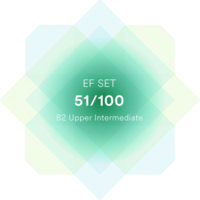

# Mikhail Matveichuk

## Junior Frontend Developer

---
## Contact information:
### tel: +375293845039
### Discord: Mikhail(@MihailMatveichuk)
### E-mail: [mihkailmatveichuk@gmail.com](mihkailmatveichuk@gmail.com)
### LinkedIn: [www.linkedin.com/in/mikhailmatveichuk](mihkailmatveichuk@gmail.com)
### Skype: [live:.cid.a99a9a51dadd0b29](live:.cid.a99a9a51dadd0b29)

---
## About me:
Hello! My name is Mikhail. I work as a lead product engineer in the plant. I want to discribe my some major responsibilities of my current job:<br/>
* work with requirements (review, changing and improvement);
* quality control of products at all stages of its life cycle according to International and State standards;
* working with design, technological and programming documentation.

Much time I have started learning different programming languages when I have been student, ve been studing in Master's degree course and then. But only for 3 month as I have realised that JS is a more suitable and more understandable language for me. I am held much time for learning and programming, because changing of my currently job is my main goal! I will be so appreciative if I can become a part of large programming family!

**My soft skills:**
* highly motivated;
* hardworking person;
* enhanced responsibility;
* attention to details;
* team player.

---
## Skills and Proficiency:
* HTML5, CSS3 [Link](https://drive.google.com/file/d/1Qw2o7ateIVVRPdfU1nnIF9-nSVgoj8iA/view?usp=sharing "HTML, CSS certificate");
* JavaScript Basics [Link](https://www.sololearn.com/Certificate/CT-GZMTVXFC/png "JavaScript ");
* Git, GitHub [Link](https://github.com/MihailMatveichuk/Git/tree/main/HW1 "Git");
* VS Code, DevTools;
* Postman, creating plain autotest scripts [Link](https://github.com/MihailMatveichuk/Postman "Postman").

---
## Code example:
**Task from Codewars (Let's Recycle!):** 
```
function recycle(array) {
    let obj = {
        'paper': [],
        'glass': [],
        'organic': [],
        'plastic': []
    };
    array.forEach(element => {
        for (let val of Object.keys(obj)) {
            if (element.material == val || element.secondMaterial == val) {
                obj[val].push(element.type);
            }
        }
});
return Object.values(obj);}
```

---
## Experience:
* Lead engineer of OJSC "AGAT - Electromechanical Plant, 2020 - 2022;
* Engineer of Military Academy Republic of Belarus, 2015 - 2020.

---
## Education:
* Military academy Republic of Belarus,
  Master of Engineering - MEng,
  2010 - 2017.

---
## Languages:
* English - B1 [EF SET Score](https://www.efset.org/cert/Yy1Pa8);<br/> 

* Russian - Native.

---


